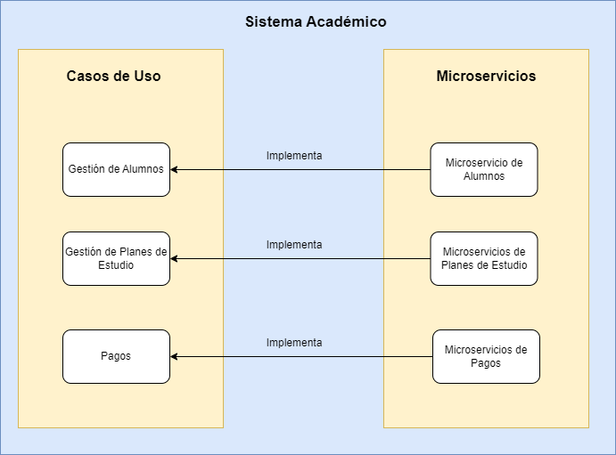

### Principios SOLID en Spring Boot ✔

**SOLID** es un conjunto de 5 principios de diseño de software que promueven la modularidad, la flexibilidad y la
facilidad de mantenimiento en el desarrollo de software. El acrónimo SOLID se origina de los siguientes principios.

* **S**ingle Responsability Principle (Principio de Responsabilidad única)
* **O**pen/Closed Principle (Principio de Abierto/Cerrado)
* **L**iskov Substitution Principle (Principio de Sustitución de Liskov)
* **I**nterface Segregation Principle (Principio de Segregación de Interfaces)
* **D**ependency Inversion Principle (Principio de Inversión de Dependencia)

A continuación se muestra una breve definición de cada uno de ellos, y un ejemplo en el contexto del proyecto que hemos
desarrollado durante el curso "**Desarrollo de Microservicios con Java**".

****

## Principio de Responsabilidad única

El principio de responsabiliad única establece que una clase debe tener un solo propósito y una sola razón para cambiar
a lo largo de su vida. Este principio asegura que una clase existe solo por una razón especializada pero puede tener
múltiples métodos para llevar a cabo diferentes funciones.

En el contexto de microservicios, cada microservicio debe implementar solo una función o característica comercial
específica. La idea es que cada microservicio se enfoque en una parte del dominio de negocio y proporcione una
funcionalidad coherente y autónoma.

Entonces considero que este principio se observa precisamente en cada microservicio que se desarrolló para la aplicación
del sistema académico, donde se tienen las funcionalidades como la gestión de alumnos, la gestión de las licenciaturas,
materias y planes de estudios, así como el procesamiento de pagos. Para cada una de estas funcionalidades se desarrolló
un microservicio, así cada microservicio implementa una sola función, lo que lo hace independiente de los otros
microservicios, y a la vez se obtienen beneficios como la modularidad, capacidad de escalar y actualizar cada
microservicio de forma individual sin afectar a los demás. Esto proporciona flexibilidad y facilita el mantenimiento y
la evolución del sistema en general.



Además, el principio de responsabilidad única se aplica dentro de cada microservicio al organizar las clases en
diferentes paquetes según su funcionalidad específica. En este caso se hizo la siguiente división de clases en los
paquetes que se describen a continuación:

📁_Entity_

Dentro del paquete Entity guardamos todas las clases que representan los modelos de nuestra aplicación. Estos modelos o
entidades se mapean a tablas en una base de datos y contiene los atributos y comportamientos relacionados con esos
datos. Estas clases tienen anotaciones que mencioné antes para la persistencia de datos como “Entity”, “Column”,
“Table”.

📁_Controller_

Dentro del paquete “Controller” almacenamos las clases que actúan como controladores. Estos controladores gestionan las
solicitudes HTTP y en ellos se define la lógica de procesamiento para las solicitudes.

📁_Repository_

El paquete “Repository” contiene las interfaces o clases que definen la capa de acceso a datos de la aplicación. Estas
interfaces proporcionan métodos para realizar operaciones como guardar, actualizar, eliminar y consultar datos en una
base de datos.

📁_Service_

Contiene las clases que implementan la lógica de negocio de la aplicación. Como hemos visto durante el curso, estos
servicios pueden utilizar los repositorios para acceder a los datos y pueden ser devueltos a través de DTOs.

📁_DTO_

Almacena las clases que se utilizan para transferir datos entre diferentes componentes de la aplicación como entre los
controladores y los servicios o en este caso entre diferentes microservicios. Los DTOs son objetos simples donde se
especifica los datos relevantes para la transferencia y con ellos evitamos la exposición de la estructura real de
nuestros modelos o entidades.

****

## Principio Abierto/Cerrado

El principio abierto/cerrado establece que las entidades de software como clases, módulos, componentes, etc. deben estar
abiertas para la extensión pero cerradas para la modificación. Esto significa que el código existente no debe ser
modificado cuando se agregan nuevas funcionalidades, sino que se debe lograr la extensión mediante la adición de nuevo
código.

En el contexto del proyecto desarrollado durante el curso, se ha observado este principio frecuentemente. Al proyecto se
le han añadido nuevas funcionalidades, como la adición de nuevos microservicios (Servicio de mensajería), así como la
adición de tecnologías como Eureka o Gateway sin necesidad de modificar el código ya existente de cada microservicio
sino con la adición de nuevo código ya sea en forma de anotaciones o en la adición de nuevas propiedades en los archivos
de configuración de cada microservicio.

Este principio se visualiza en la adición de la tecnología Eureka para el registro y descubrimiento de los
microservicios. Para poder añadir esta funcionalidad a nuestro proyecto se siguieron los siguientes pasos y como se
observará nunca se modifica el código existente para poder añadir esta nueva funcionalidad a nuestro sistema.

1. Crear el proyecto que utilice la dependencia Eureka Server de Netflix.

```xml

<dependency>
    <groupId>org.springframework.cloud</groupId>
    <artifactId>spring-cloud-starter-netflix-eureka-server</artifactId>
</dependency>
```

2. A la clase principal del proyecto añadir la anotación @EnableEurekaServer.

```java

@SpringBootApplication
@EnableEurekaServer
public class DiscoverServiceApplication {

    public static void main(String[] args) {
        SpringApplication.run(DiscoverServiceApplication.class, args);
    }

}
```

3. Añadir las propiedades correspondientes al archivo de configuración.

```yml
eureka:
  client:
    register-with-eureka: false
    fetch-registry: false
    service-url:
      default-zone: http://${eureka.instance.hostname}:${server.port}/eureka
  instance:
    lease-expiration-duration-in-seconds: 5
    lease-renewal-interval-in-seconds: 5
spring:
  application:
    name: registry-service

server:
  port: 8761
```

4. Para que nuestros microservicios puedan ser registrados y descubiertos por Eureka, solo tenemos que agregar la
   dependencia Eureka Client de Netflix.

````xml

<dependency>
    <groupId>org.springframework.cloud</groupId>
    <artifactId>spring-cloud-starter-netflix-eureka-client</artifactId>
</dependency>
````

5. Agregar las propiedades correspondientes para que el microservicio pueda ser registrado y buscado por otros
   microservicios con Eureka.

````properties
spring.application.name=coa-api
spring.cloud.discovery.enabled=true
eureka.client.fetch-registry=true
eureka.client.register-with-eureka=true
eureka.client.service-url.default-zone=http://localhost:8761/eureka/
eureka.client.instance.instance-id=${spring.application.name}:${spring.application.instance_id:${random.value}}
````

Entonces, como se demostró, para añadir esta nueva funcionalidad a nuestro sistema basta con añadir el código y las
configuraciones correspondientes sin necesidad de modificar el código de los microservicios, lo mismo sucede al añadir
un Gateway, o crear un nuevo microservicio, es decir, podemos extender el sistema sin alterar el código existente, por
lo que se cumple con el principio de abierto/cerrado.

****

## Principio de Sustitución de Liskov

El principio de sustitución de Liskov establece que las instancias de una clase base deben poder ser sustituidas por sus
instancias de sus clases derivadas sin alterar la corrección del programa. Es decir, las clases derivadas deben
comportarse de forma compatible con la clase base, cumpliendo los mismos contratos y manteniendo las propiedades y
comportamientos esperados.

Para demostrar el cumplimiento de este principio de nuestro proyecto podemos utilizar el servicio de pagos.

Como se observa en el siguiente código, podemos utilizar la clase JpaRepository la cual define un contrato que establece
los métodos genéricos para las operaciones CRUD, como "findAll()", "save()", "deleteByID()" entre otros.

````java

@Service
@Log4j2
public class PagoService {

    @Autowired
    private JpaRepository<Pago, Long> pagoRepository;

    public List<Pago> getAllPagos() throws Exception {
        List<Pago> pagoList = pagoRepository.findAll();

        if (pagoList.isEmpty()) {
            throw new COAException("No se encontraron datos");
        }

        return pagoList;
    }

    public Pago createPago(Pago pago) {
        log.info("Se crea pago: " + pago.toString());
        return pagoRepository.save(pago);
    }

    public Pago updatePago(Pago pago) throws Exception {
        return pagoRepository.save(pago);
    }

    public void deletePago(Long id) {
        pagoRepository.deleteById(id);
    }
}
````

Entonces, como establece el principio cualquier clase que extienda de JpaRepository debe implementar los métodos de
JpaRepository.

Por lo tanto, se crea la siguiente interfaz "**PagoRepository**" que extiende de **JpaRepository**, y sus
implementaciones debe ser compatibles con el contrato de **JpaRepository**. Esto implica que los métodos heredados de **JpaRepository** deben comportarse de acuerdo a las especificaciones definidas en esa clase, además de proporcionar
implementaciones adicionales para las operaciones relacionadas con los pagos definidas en **PagoRepository**.

````java
public interface PagoRepository extends JpaRepository<Pago, Long> {

    Optional<Pago> findByAlumnoIdAndMateriaId(Long AlumnoId, Long MateriaId);
}
````

Entonces, al sustituir JpaRepository por PagoRepository en el servicio el código debe seguir funcionando correctamente,
ya que PagoRepository cumple con los métodos establecidos por JpaRepository, tal como se muestra a continuación.

````java

@Service
@Log4j2
public class PagoService {

    @Autowired
    private PagoRepository pagoRepository;

    public List<Pago> getAllPagos() throws Exception {
        List<Pago> pagoList = pagoRepository.findAll();

        if (pagoList.isEmpty()) {
            throw new COAException("No se encontraron datos");
        }

        return pagoList;
    }

    public Pago createPago(Pago pago) {
        log.info("Se crea pago: " + pago.toString());
        return pagoRepository.save(pago);
    }

    public Pago updatePago(Pago pago) throws Exception {
        Optional<Pago> pagoOptional = pagoRepository.findByAlumnoIdAndMateriaId(pago.getAlumnoId(), pago.getMateriaId());

        if (pagoOptional.isPresent()) {
            log.info("Actualizando pago: " + pago.toString());
            return pagoRepository.save(pago);
        }

        throw new COAException("No se encontró el pago: " + pago.toString());
    }

    public void deletePago(Long id) {
        pagoRepository.deleteById(id);
    }
}
````
Por lo tanto, al poder reemplazar la implementación concreta de JpaRepository por PagoRepository sin afectar la ejecución del sistema y sin introducir
comportamientos inesperados, se cumple con el principio de sustitución de Liskov.

****

## Principio de Segregación de Interfaces

El principio de segregación de interfaces establece que los clientes no deben ser obligados a depender de interfaces que no utilizan. Es decir, es mejor tener
interfaces específicas y cohesivas en lugar de interfaces genéricas y sobrecargadas.

Este principio se observa en el proyecto con el uso de @OpenFeign.

Como se observa a continuación, tenemos la clase PlanEstudiosController que expone todos los métodos del microservicio para la gestión de los planes de estudio.

````java
@RestController
@RequestMapping("/plan-estudios")
@Log4j2
public class PlanEstudioscontroller {
    @Autowired
    private PlanEstudiosService planEstudiosService;

    @GetMapping
    public ResponseEntity<?> findAllPlanEstudios(){
        try {
            return ResponseEntity.ok().body(planEstudiosService.getAllPlanEstudios());
        }catch (COAException ex){
            log.warn("Sin datos");
            log.error(ex);
            return new ResponseEntity<>(ex.getMessage(), HttpStatus.BAD_REQUEST);
        } catch (Exception e) {
            throw new RuntimeException(e);
        }
    }

    @GetMapping(value = ("/{licenciatura-id}"))
    public ResponseEntity<?> findByLicenciaturaId(@PathVariable(value = "licenciatura-id") long licenciatruaId){
        try {
            return ResponseEntity.ok().body(planEstudiosService.getLicienciatruaMaterias(licenciatruaId));
        }catch (COAException ex){
            log.warn("Sin datos");
            log.error(ex);
            return new ResponseEntity<>(ex.getMessage(), HttpStatus.BAD_REQUEST);
        } catch (Exception e) {
//            throw new RuntimeException(e);
            return new ResponseEntity<>(e.getMessage(), HttpStatus.BAD_REQUEST);
        }
    }

    @PostMapping
    public ResponseEntity createPlanEstudios(@RequestBody PlanEstudio planEstudio){
        try {
            return new ResponseEntity<>(planEstudiosService.createPlanEstudio(planEstudio), HttpStatus.CREATED);
        }catch (COAException ex){
            log.warn("Sin datos");
            log.error(ex);
            return new ResponseEntity<>(ex.getMessage(), HttpStatus.BAD_REQUEST);
        } catch (Exception e) {
            throw new RuntimeException(e);
        }
    }

    @PutMapping
    public ResponseEntity updatePlanEstudios(@RequestBody PlanEstudio planEstudio){
        try {
            return new ResponseEntity<>(planEstudiosService.updatePlanEstudio(planEstudio), HttpStatus.CREATED);
        }catch (COAException ex){
            log.warn("Sin datos");
            log.error(ex);
            return new ResponseEntity<>(ex.getMessage(), HttpStatus.BAD_REQUEST);
        } catch (Exception e) {
            throw new RuntimeException(e);
        }
    }
}
````
Sin embargo, el microservicio para la gestión de alumnos solo necesita utilizar uno de los métodos expuestos por el controlador PlanEstudios, por lo que podemos definir
una interfaz que solo contiene el método necesario, tal como se muestra a continuación. OpenFeign es una biblioteca de cliente HTTP declarativa
para servicios web RESTful, y proporciona una forma sencilla de definir interfaces en el lado del cliente que especifican las llamadas a los servicios web. Estas interfaces
actúan como "contratos" entre los microservicios.

````java
@FeignClient(name = "coa-api", path = "/coa-api/plan-estudios", url = "")
public interface IPlanEstudiosClient {

    @GetMapping(value = ("/{licenciatura-id}"))
    ResponseEntity<LicenciaturaMateriaDTO> findByLicenciaturaId(@PathVariable(value = "licenciatura-id") long licenciatruaId);
}
````
Entonces, el uso de OpenFeign se alinea con este principio porque nos permite definir interfaces específicas para cada microservicio. En lugar de depender
directamente de las implementaciones concretas de los microservicios, los clientes se comunican con ellos a través de interfaces que exponen solo
los métodos necesarios para su funcionalidad.

****
## Principio de Inversión de Dependencia

El principio de inversión de dependencia establece que los módulos de alto nivel no deben depender de los módulos de bajo nivel. Ambos deben depender de abstracciones. Además, las abstracciones
no deben depender de los detalles concretos, sino que los detalles concretos deben depender de las abstracciones.

En el contexto del proyecto, se puede utilizar el ejemplo anterior con el uso de la interfaz **IPlanEstudiosClient**. En lugar de depender directamente
del microservicio de gestión de planes de estudio, el microservicio de gestión de alumnos utiliza la abstracción definida en la interfaz, lo cual representa
una inversión de dependencia.

Entonces al utilizar OpenFeign y definir la interfaz **IPlanEstudiosClient** se está estableciendo una abstracción que actúa como un contrato entre los microservicios.

````java
@FeignClient(name = "coa-api", path = "/coa-api/plan-estudios", url = "")
public interface IPlanEstudiosClient {

    @GetMapping(value = ("/{licenciatura-id}"))
    ResponseEntity<LicenciaturaMateriaDTO> findByLicenciaturaId(@PathVariable(value = "licenciatura-id") long licenciatruaId);
}
````
Y como se observa a continuación, el servicio de Kardex hace uso de esta abstracción para comunicarse con el microservicio de planes de estudio en lugar de depender directamente del microservicio o de una implementación específica del método que quiere utilizar.

````java
@Service
@Log4j2
public class KardexService {

    @Autowired(required=true)
    private IPlanEstudiosClient planEstudiosClient;

   public KardexAlumno findByKardexByAlumno(String matricula) throws Exception {
      // Código ...
      ResponseEntity<?> response = planEstudiosClient.findByLicenciaturaId(kardex.get(0).getAlumno().getLicenciaturaId());
````

Por lo tanto, este es un ejemplo que demuestra el cumplimiento del principio de inversión de dependencia dentro del proyecto lo que proporciona una mayor flexibilidad, modularidad e independencia entre los microservicios.